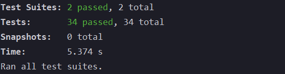

## learning-TDD
기본적인 CRUD를 구현하며 학습한 TDD
express, mongodb, jest, supertest
---
<br>



## jest
---
Facebook에 의해 만들어진 테스팅 프레임워크. 최소한의 설정으로 동작. Unit 테스트를 위해 사용.

<br>


## Jest 파일 구성 및 구조 (주요 기능만 간략히)
---
- ***describe***<br>
`argument (name, fn)`<br>
여러 관련 테스트를 그룹화 하는 블록 생성
- ***it*** __ same as ***test***<br>
`argument(name, fn, timeout)`<br>
개별 테스트를 수행하는 곳, 각 테스트를 작은 문장처럼 설명
- ***expect***<br>
값을 테스트할 때마다 사용. expect 함수 혼자서 사용되는 경우는 거의 없으며 대부분 matcher와 함께 사용
- ***matcher***<br>
`argument (name, fn)`<br>
다양한 방법으로 값을 테스트할 수 있도록 해주는 것
- ***jest.fn***<br>
Mock 함수를 생성하는 함수. 단위 테스트를 작성할 때, 해당 코드가 의존하는 부분을 가짜로 대체하는 일을 해줌
```
decribe
  |_ (test) it
            |_ expect (+ matcher)
  |_ (test) it
  |_ (test) it
```

## supertest
---
jest 하나만으론 불가능한 Intergration 테스트를 위해 사용.
